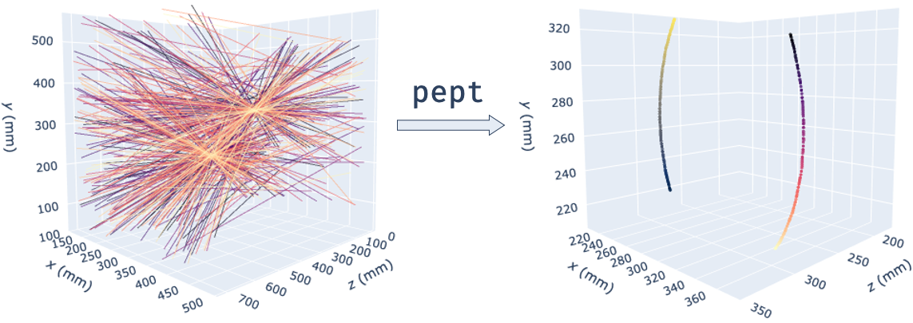
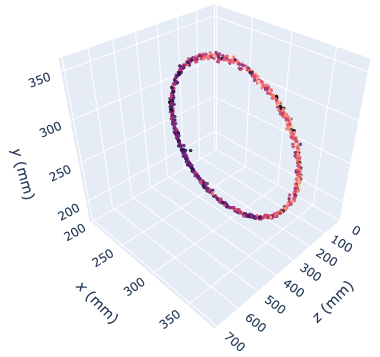

..
   File   : index.rst
   License: GNU v3.0
   Author : Andrei Leonard Nicusan <a.l.nicusan@bham.ac.uk>
   Date   : 28.06.2020

PEPT Documentation
==================
PEPT - a Python library that unifies Positron Emission Particle Tracking
(PEPT) research, including tracking, simulation, data analysis and
visualisation tools.

.. toctree::
   :maxdepth: 3
   :caption: Contents:

   pept_tutorials
   pept_api

Positron Emission Particle Tracking
-----------------------------------
PEPT is a technique developed at the University of Birmingham which allows the
non-invasive, three-dimensional tracking of one or more 'tracer' particles
through particulate, fluid or multiphase systems. The technique allows particle
or fluid motion to be tracked with sub-millimetre accuracy and sub-millisecond
temporal resolution and, due to its use of highly-penetrating 511keV gamma
rays, can be used to probe the internal dynamics of even large, dense,
optically opaque systems - making it ideal for industrial as well as scientific
applications [1]_.

PEPT is performed by radioactively labelling a particle with a positron-
emitting radioisotope such as fluorine-18 (18F) or gallium-66 (66Ga), and using
the back-to-back gamma rays produced by electron-positron annihilation events
in and around the tracer to triangulate its spatial position. Each detected
gamma ray represents a line of response (LoR).

Transforming gamma rays, or lines of response (left) into individual tracer
trajectories (right) using the `pept` library. Depicted is experimental data of
two tracers rotating at 42 RPM, imaged using the University of Birmingham
Positron Imaging Centre's parallel screens PEPT camera.

Getting Started
===============
These instructions will help you get started with PEPT data analysis.

Prerequisites
-------------
This package supports Python 3.6 and above - it is built and tested for Python
3.6, 3.7 and 3.8 on Windows, Linux and macOS (thanks to conda-forge_, which is
awesome!).

You can install it using the batteries-included Anaconda_ distribution or the
bare-bones Python_ interpreter. You can also check out our Python and `pept`
tutorials_.

.. _conda-forge: https://conda-forge.org/
.. _Anaconda: https://www.anaconda.com/products/individual
.. _Python: https://www.python.org/downloads/
.. _tutorials: https://github.com/uob-positron-imaging-centre/tutorials

Installation
------------
The easiest and quickest installation, if you are using Anaconda:

::

    conda install -c conda-forge pept

You can also install the latest release version of `pept` from PyPI:

::

    pip install --upgrade pept

Or you can install the development version from the GitHub repository:

::

    pip install -U git+https://github.com/uob-positron-imaging-centre/pept

Example usage
-------------
A minimal analysis script using the PEPT-ML algorithm [2]_ from the
`pept.tracking.peptml` package:

.. code-block:: python

    import pept
    from pept.tracking import peptml

    # Read in LoRs from a web-hosted CSV file.
    lors_raw = pept.utilities.read_csv(
        ("https://raw.githubusercontent.com/uob-positron-imaging-centre/"
        "example_data/master/sample_2p_42rpm.csv"),   # Concatenate long string
        skiprows = 16                                 # Skip file header
    )

    # Encapsulate LoRs in a `LineData` subclass and compute cutpoints.
    lors = pept.scanners.ParallelScreens(lors_raw, screen_separation = 712)
    cutpoints = peptml.Cutpoints(lors, max_distance = 0.15)

    # Cluster cutpoints using HDBSCAN and extract tracer locations.
    clusterer = peptml.HDBSCANClusterer()
    centres = clusterer.fit(cutpoints)

    # Plot tracer locations using Plotly.
    grapher = pept.visualisation.PlotlyGrapher()
    grapher.add_points(centres)
    grapher.show()

Running the above code initialises 80,000 lines of PEPT data from an online
location (containing the same experiment as before - two tracers rotating at 42
RPM), transforms lines of response into accurate tracer locations and plots
them in a 3D interactive browser-based graph:

You can download some PEPT data samples from the UoB Positron Imaging Centre's
repository_:

.. _repository: https://github.com/uob-positron-imaging-centre/example_data

::

    $> git clone https://github.com/uob-positron-imaging-centre/example_data

Performance
-----------
Significant effort has been put into making the algorithms in this package as
fast as possible. The most compute-intensive parts have been implemented in
`C` / `Cython` and parallelised, where possible, using `joblib` and
`concurrent.futures.ThreadPoolExecutor`. For example, using the `peptml`
subpackage [2]_, analysing 1,000,000 LoRs on the author's machine (mid 2012
MacBook Pro) takes ~26 seconds.

Citing
------
If you used this codebase or any software making use of it in a scientific
publication, we ask you to cite the following paper:

    Nicuşan AL, Windows-Yule CR. Positron emission particle tracking using
    machine learning. Review of Scientific Instruments. 2020 Jan 1;91(1):013329
    https://doi.org/10.1063/1.5129251

Licensing
---------
The `pept` package is GNU v3.0 licensed.
Copyright (C) 2020 Andrei Leonard Nicusan.

References
----------
.. [1] Parker DJ, Broadbent CJ, Fowles P, Hawkesworth MR, McNeil P. Positron
   emission particle tracking-a technique for studying flow within engineering
   equipment. Nuclear Instruments and Methods in Physics Research Section A:
   Accelerators, Spectrometers, Detectors and Associated Equipment. 1993
   Mar 10;326(3):592-607.
.. [2] Nicuşan AL, Windows-Yule CR. Positron emission particle tracking using
   machine learning. Review of Scientific Instruments. 2020 Jan 1;91(1):013329.

Indices and tables
==================

* :ref:`genindex`
* :ref:`modindex`
* :ref:`search`
